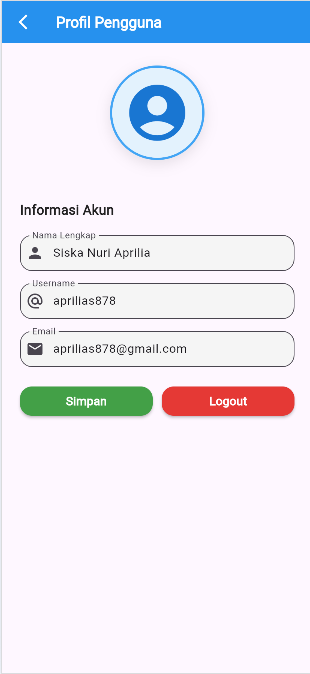

# 📱 Pemrograman Mobile – Expense Manager

Aplikasi **Expense Manager** ini dibuat sebagai tugas mata kuliah **Pemrograman Mobile**.  

---

## 👩‍🎓 Identitas Mahasiswa
**Nama:** Siska Nuri Aprilia  
**NIM:** 2341760038
**Kelas:** SIB-3E  

---
## 📖 Deskripsi Project
Aplikasi Expense Manager merupakan aplikasi mobile berbasis Flutter yang dirancang untuk membantu pengguna dalam mengelola keuangan pribadi secara sederhana dan efisien. Melalui aplikasi ini, pengguna dapat mencatat dan memantau pengeluaran harian, melihat riwayat transaksi, serta menampilkan statistik keuangan dalam bentuk grafik untuk memahami pola penggunaan uang.

Fitur pencatatan pemasukan (income tracking) masih dalam tahap pengembangan, namun aplikasi sudah dapat digunakan untuk mencatat dan menganalisis pengeluaran secara fungsional.
Aplikasi ini sangat cocok digunakan sebagai projek latihan Flutter untuk memahami konsep state management, CRUD data, navigasi antarhalaman, dan penyimpanan lokal.

---
## Fitur Aplikasi
| Fitur / Screen | Screenshot | Penjelasan |
|----------------|-----------|------------|
| **Login** |  | Menampilkan halaman untuk masuk ke aplikasi dengan memasukkan email dan password pengguna. Jika data yang dimasukkan cocok dengan akun yang telah terdaftar, maka pengguna akan berhasil login dan diarahkan ke halaman utama (HomeScreen). Apabila password salah, akan muncul pesan kesalahan, dan jika akun belum terdaftar, pengguna akan diminta untuk melakukan registrasi terlebih dahulu. |
| **Register** |  | Menampilkan halaman untuk mendaftarkan akun baru dengan mengisi data nama lengkap, email, username, password, dan konfirmasi password. Jika semua data sudah terisi dan valid, sistem akan menyimpan data pengguna baru ke dalam daftar user menggunakan UserManager.addUser. Apabila kolom belum diisi, password tidak cocok, atau email/username sudah terdaftar, akan muncul pesan kesalahan melalui SnackBar. Setelah registrasi berhasil, pengguna akan mendapat pesan “Registrasi berhasil! Silakan login.†dan diarahkan kembali ke halaman login. |
| **Home Screen** |  | Menampilkan halaman utama setelah pengguna berhasil login. Halaman ini berfungsi untuk menampilkan informasi pengguna yang sedang aktif dan menjadi pusat navigasi menuju fitur lain seperti pencatatan pengeluaran, statistik keuangan, dan pengaturan profil. Di bagian atas terdapat AppBar dengan judul aplikasi dan ikon menu untuk membuka Drawer. Drawer ini berisi informasi pengguna seperti nama dan email, serta beberapa opsi seperti menuju halaman Profile, Settings, dan tombol Logout. |
| **Profile** |  | Menampilkan dan mengelola informasi profil pengguna yang sedang login. Pengguna dapat melihat serta mengedit data pribadinya seperti nama lengkap, username, dan email. Data tersebut disimpan menggunakan SharedPreferences agar perubahan tetap tersimpan. |
| **Settings Screen** |  | Menampilkan beberapa opsi seperti Language (bahasa), Notifications (notifikasi), dan About (tentang aplikasi). |
| **Expense Screen** |  | Menampilkan daftar semua transaksi pengeluaran yang telah dicatat oleh pengguna. Pengguna dapat melihat rincian setiap pengeluaran seperti judul transaksi, kategori, tanggal, dan jumlah uang yang dikeluarkan. Halaman ini juga menampilkan statistik keuangan sederhana, yaitu rata-rata pengeluaran harian dan pengeluaran tertinggi. |
| **Advanced Expense List Screen** |  | Halaman utama untuk menampilkan dan mengelola seluruh pengeluaran pengguna. Pengguna dapat melihat daftar transaksi lengkap dengan kategori, tanggal, dan jumlah pengeluaran, serta menggunakan fitur pencarian, filter kategori, dan filter tanggal. Pengguna juga dapat menambahkan, mengedit, atau menghapus pengeluaran secara langsung. |
| **Add Expense Screen** |  | Berfungsi untuk menambahkan data pengeluaran baru. Pengguna dapat memasukkan judul, deskripsi, kategori, jumlah (Rp), dan tanggal transaksi. Tanggal dapat dipilih menggunakan Date Picker, dan sistem menampilkan konfirmasi sebelum menyimpan. Setelah disimpan, pengeluaran baru ditambahkan ke daftar pengeluaran utama. |
| **Edit Expense Screen** |  | Berfungsi untuk mengubah data pengeluaran yang sudah ada. Pengguna dapat memperbarui judul, deskripsi, kategori, jumlah (Rp), dan tanggal transaksi. Data awal ditampilkan otomatis sesuai pengeluaran yang dipilih. Kategori dapat dipilih melalui Dropdown dan tanggal melalui Date Picker. Sistem menampilkan dialog konfirmasi sebelum menyimpan perubahan. |
| **Export Screen** |  | Berfungsi untuk mengekspor data pengeluaran ke format CSV atau PDF. |
| **Category Screen** |  | Berfungsi untuk mengelola kategori pengeluaran. Pengguna dapat menambahkan kategori baru melalui input teks dan tombol “Tambah”, serta menghapus kategori yang sudah ada dengan tombol hapus pada setiap item. Sistem menampilkan dialog konfirmasi sebelum menambah atau menghapus kategori. |
| **Statistics Screen** |  | Berfungsi untuk menampilkan statistik dan visualisasi pengeluaran. Pengguna dapat melihat ringkasan keuangan berupa rata-rata harian, pengeluaran tertinggi, dan total pengeluaran. |
